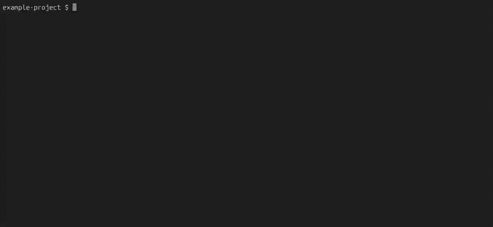

<h1 align="center">CellState</h1>
<p align="center"><strong>React terminal renderer with cell-level diffing and native scrollback. No alternate screen.</strong></p>
<p align="center">
  <a href="https://www.npmjs.com/package/cellstate"></a>
  <a href="https://github.com/nathan-cannon/cellstate/actions/workflows/test.yml"></a>
  <a href="https://reactjs.org"></a>
  <a href="https://www.typescriptlang.org"></a>
  <a href="https://github.com/nathan-cannon/cellstate/blob/main/LICENSE"></a>
</p>

CellState is a React terminal renderer with cell-level diffing and native scrollback. It renders into the main terminal buffer with no alternate screen. Content scrolls naturally, persists after exit, and works with native terminal features like search, text selection, copy/paste, and scrollback.

Streaming syntax-highlighted markdown into a 250-message conversation renders in under 10ms per frame. Frame coalescing merges rapid React commits into a single frame, and backpressure handling defers frames when stdout can't keep up.

CellState detects terminal capabilities at startup and adapts its output. Synchronized output, OSC 8 hyperlinks, platform-specific clear sequences, non-TTY fallback, and clean Ctrl+Z recovery all work automatically.

Unicode handling covers CJK characters, emoji, grapheme clusters, ZWJ sequences, and variation selectors. Layout, paint, and diff all operate on terminal column widths, not string lengths.

---

<p align="center"></p>

<p align="center"><em>CellState rendering a coding agent UI via OpenCode's serve API</em></p>

---

## Quickstart

CellState is **ESM-only** and requires **React 19+** and **Node 18+**.

**1. Install**
```bash
npm install cellstate react@19
npm install -D typescript @types/react@19 @types/node tsx
```

**2. `package.json`**: must include `"type": "module"`
```json
{
  "name": "my-cli",
  "type": "module",
  "private": true,
  "scripts": {
    "dev": "tsx src/app.tsx"
  }
}
```

**3. `tsconfig.json`**: minimum working config
```json
{
  "compilerOptions": {
    "target": "ES2022",
    "module": "NodeNext",
    "moduleResolution": "NodeNext",
    "jsx": "react-jsx",
    "strict": true,
    "esModuleInterop": true,
    "skipLibCheck": true
  },
  "include": ["src"]
}
```

**4. `src/app.tsx`**: hello world
```tsx
import React, { useState } from 'react';
import { render, Box, Text, useInput, useApp } from 'cellstate';

function App() {
  const { exit } = useApp();
  const [count, setCount] = useState(0);

  useInput((key) => {
    if (key.type === 'ctrl' && key.ctrlKey === 'c') exit();
    if (key.type === 'up') setCount(c => c + 1);
    if (key.type === 'down') setCount(c => c - 1);
  });

  return (
    <Box flexDirection="column">
      <Text bold>Count: {count}</Text>
      <Text dim>↑/↓ to change, Ctrl+C to exit</Text>
    </Box>
  );
}

const app = render(<App />);
await app.waitUntilExit();
```

**5. Run**
```bash
npm run dev
```

> **Note:** All components are capitalized (`<Box>`, `<Text>`, `<Divider>`). CellState does not expose lowercase JSX intrinsics. Always import components from `'cellstate'`.


## Contents
  - [Getting Started](#getting-started)
  - [App Lifecycle](#app-lifecycle)
  - [Components](#components)
    - [`<Text>`](#text)
    - [`<Box>`](#box)
    - [`<Divider>`](#divider)
  - [Hooks](#hooks)
    - [useInput](#useinput)
    - [useApp](#useapp)
    - [useFocus](#usefocus)
    - [useFocusManager](#usefocusmanager)
    - [useDimensions](#usedimensions)
  - [Utilities](#utilities)
    - [renderOnce](#renderonce)
    - [`<Markdown>`](#markdown)
    - [`<StreamingMarkdown>`](#streamingmarkdown)
    - [measureElement](#measureelement)
    - [decodeKeypress](#decodekeypress)
    - [Display Width](#display-width)


## Getting Started
CellState uses [Yoga](https://github.com/facebook/yoga) to create Flexbox layouts in the terminal, allowing you to build user interfaces for your CLIs using familiar CSS-like properties. `<Box>` is your layout container (like `<div>` with `display: flex`), `<Text>` renders styled text. State changes via hooks trigger re-renders automatically.

All visible text must be inside a `<Text>` component. You can use plain string children or structured segments for mixed styles. The built-in `<Markdown>` and `<StreamingMarkdown>` components parse markdown via remark, syntax-highlight code blocks via tree-sitter, and render through the `<RawAnsi>` fast path, bypassing React reconciliation and Yoga layout for the markdown content.

## App Lifecycle

An app using CellState stays alive until you call `unmount()`. You don't need to keep the event loop busy; the renderer handles that internally. Signal handling is your responsibility, so you decide when and how your app exits.

### What `render()` does

A single call sets up the full terminal pipeline:

1. Creates the frame loop (reconciler → layout → paint → damage-scoped diff → emit → stdout)
2. Hides the cursor
3. Puts stdin in raw mode for keypress handling
4. Redirects `console.log`/`info`/`warn`/`error`/`debug` to stderr (enabled by default, disable with `patchConsole: false`)
5. Listens for terminal resize (triggers automatic re-layout and full redraw)
6. Wraps your component in an error boundary that restores terminal state on crash

Console patching is enabled by default. To disable it:
```tsx
const app = render(<App />, { patchConsole: false });
```

Custom stdout/stdin streams (defaults to `process.stdout` and `process.stdin`):
```tsx
const app = render(<App />, { stdout: myStream, stdin: myInputStream });
```

### What `render()` returns
```typescript
interface RenderInstance {
  unmount: () => void;                     // Stop rendering, restore terminal state
  waitUntilExit: () => Promise<unknown>;   // Resolves when unmount() is called
  dumpFrameLog: (path: string) => void;    // Write frame state snapshot to file (debugging)
}
```

`unmount()` is idempotent and safe to call multiple times. It restores raw mode, re-shows the cursor, stops the frame loop, restores original console methods, and cleans up all listeners. If your component tree throws during a render, the error boundary calls `unmount()` automatically and prints the error to stderr.

`dumpFrameLog(path)` writes the current frame state to a JSON file for debugging rendering issues. Includes viewport dimensions, scrollback state, buffer sizes, and interning table sizes.

### Waiting for Exit

Use `waitUntilExit()` to run code after the app is unmounted:
```tsx
const app = render(<App />);

process.on('SIGINT', () => app.unmount());

await app.waitUntilExit();
console.log('App exited');
process.exit(0);
```

### Low-Level API

For custom pipelines or when you need direct control over the frame loop:
```tsx
import { createFrameLoop } from 'cellstate';

const loop = createFrameLoop(process.stdout);
loop.start(<App />);
loop.update(<App newProps={...} />);
loop.getBuffer();      // Current packed cell buffer
loop.getCharTable();   // Character interning table
loop.getStyleTable();  // Style interning table
loop.getLinkTable();   // Hyperlink interning table
loop.perfSnapshot();   // Performance counters (when perf: true)
loop.stop();
```

This is what `render()` uses internally. You get full control over the lifecycle but are responsible for raw mode, cursor visibility, and cleanup yourself.

**Options:**

| Option | Type | Default | Description |
|---|---|---|---|
| `perf` | `boolean` | `false` | Enable in-memory performance instrumentation |
| `immediateMode` | `boolean` | `false` | Bypass frame coalescing; every React commit renders synchronously. Useful for tests |
| `capabilities` | `Partial<TerminalCapabilities>` | auto-detected | Override detected terminal capabilities (e.g. `synchronizedOutput`) |

Enable performance instrumentation to see incremental paint stats, frame classification counters, and pipeline timings:
```tsx
const loop = createFrameLoop(process.stdout, { perf: true });
// ... after some frames ...
const snap = loop.perfSnapshot();
console.log(snap.counts.subtreeBlits);    // subtrees blitted from front buffer
console.log(snap.counts.subtreesPainted); // subtrees repainted fresh
```


## Components

### `<Text>`
Renders styled text with automatic line wrapping.

```tsx
<Text>Plain text</Text>
<Text bold>Bold text</Text>
<Text color="#00ff00">Green text</Text>
<Text bold italic color="#ff0000" backgroundColor="#333333">Styled text</Text>
<Text dim>Muted text</Text>
<Text inverse>Inverted text (fg/bg swapped)</Text>
```

#### Props
| Property          | Type        | Description                                               |
|-------------------|-------------|-----------------------------------------------------------|
| `bold`            | `boolean`   | Bold weight                                               |
| `italic`          | `boolean`   | Italic style                                              |
| `underline`       | `boolean`   | Underline                                                 |
| `strikethrough`   | `boolean`   | Strikethrough text                                        |
| `dim`             | `boolean`   | Dimmed/faint text                                         |
| `inverse`         | `boolean`   | Swap foreground and background colors                     |
| `color`           | `string`    | Foreground color (`#RRGGBB` hex). Also available as `fg`  |
| `backgroundColor` | `string`    | Background color (`#RRGGBB` hex)                          |
| `hangingIndent`   | `number`    | Indent for wrapped continuation lines                     |
| `wrap`            | `string`    | Text overflow: `'wrap'` (default), `'truncate'`, `'truncate-start'`, `'truncate-middle'` |
| `segments`        | `Segment[]` | Multiple styled sections in one text element              |

When text exceeds the available width, `wrap` controls how it's handled:

```tsx
<Text wrap="truncate">/Users/me/very/long/path/to/file.tsx</Text>
// → /Users/me/very/long/path/to/fi…

<Text wrap="truncate-start">/Users/me/very/long/path/to/file.tsx</Text>
// → …ery/long/path/to/file.tsx

<Text wrap="truncate-middle">/Users/me/very/long/path/to/file.tsx</Text>
// → /Users/me/ver…to/file.tsx
```

`truncate` and `truncate-end` are aliases. `truncate-start` is useful for file paths where the end matters more.

**Known limitation:** Truncation with styled segments collapses to plain text, losing per-segment styles. If you need truncated text with mixed styles, apply truncation to the text content before passing it as segments.

For mixed styles in a single element, use segments:

```tsx
<Text segments={[
  { text: 'Error: ', style: { bold: true, color: '#ff0000' } },
  { text: 'file not found' },
]} />
```

Segment styles support: `bold`, `italic`, `underline`, `strikethrough`, `dim`, `inverse`, `color`, and `backgroundColor`.


### `<Box>`
Container element for layout. Stack children vertically or horizontally.

```tsx
<Box flexDirection="column" gap={1}>
  <Text>First</Text>
  <Text>Second</Text>
</Box>

<Box flexDirection="row">
  <Box width={20}><Text>Sidebar</Text></Box>
  <Box flexGrow={1}><Text>Main content</Text></Box>
</Box>

<Box borderStyle="round" borderColor="#888888" padding={1}>
  <Text>Boxed content</Text>
</Box>
```
#### Props

| Property          | Type                                                   | Description                                          |
|-------------------|--------------------------------------------------------|------------------------------------------------------|
| `display`         | `'flex' \| 'none'`                                    | Hide component and children (default: `flex`)        |
| `flexDirection`   | `'column' \| 'row'`                                   | Stack direction (default: `column`)                  |
| `gap`             | `number`                                               | Space between children                               |
| `columnGap`       | `number`                                               | Gap between columns (overrides `gap` for horizontal axis) |
| `rowGap`          | `number`                                               | Gap between rows (overrides `gap` for vertical axis) |
| `width`           | `number`                                               | Fixed width in columns                               |
| `height`          | `number`                                               | Fixed height in rows                                 |
| `widthPercent`    | `number`                                               | Width as percentage of parent (0-100)                |
| `heightPercent`   | `number`                                               | Height as percentage of parent (0-100)               |
| `minWidth`        | `number`                                               | Minimum width in columns                             |
| `maxWidth`        | `number`                                               | Maximum width in columns                             |
| `minHeight`       | `number`                                               | Minimum height in rows                               |
| `maxHeight`       | `number`                                               | Maximum height in rows                               |
| `flexGrow`        | `number \| boolean`                                    | Fill remaining space in row layout                   |
| `flexShrink`      | `number`                                               | How much this child should shrink relative to siblings (default: `0`) |
| `flexBasis`       | `number \| string`                                     | Initial main-axis size before flex grow/shrink       |
| `flexWrap`        | `'nowrap' \| 'wrap' \| 'wrap-reverse'`                 | Allow children to wrap to the next line (default: `nowrap`) |
| `alignItems`      | `'stretch' \| 'flex-start' \| 'center' \| 'flex-end'` | Cross-axis alignment (default: `stretch`)            |
| `alignSelf`       | `'auto' \| 'stretch' \| 'flex-start' \| 'center' \| 'flex-end'` | Override parent's `alignItems` for this child |
| `alignContent`    | `'stretch' \| 'flex-start' \| 'center' \| 'flex-end' \| 'space-between' \| 'space-around' \| 'space-evenly'` | Cross-axis distribution of wrapped lines |
| `justifyContent`  | `'flex-start' \| 'center' \| 'flex-end' \| 'space-between' \| 'space-around' \| 'space-evenly'` | Main-axis distribution of children (default: `flex-start`) |
| `padding`         | `number`                                               | Padding on all sides                                 |
| `paddingX`        | `number`                                               | Shorthand for `paddingLeft` + `paddingRight`         |
| `paddingY`        | `number`                                               | Shorthand for `paddingTop` + `paddingBottom`         |
| `paddingLeft`     | `number`                                               | Left padding                                         |
| `paddingRight`    | `number`                                               | Right padding                                        |
| `paddingTop`      | `number`                                               | Top padding                                          |
| `paddingBottom`   | `number`                                               | Bottom padding                                       |
| `margin`          | `number`                                               | Margin on all sides                                  |
| `marginX`         | `number`                                               | Shorthand for `marginLeft` + `marginRight`           |
| `marginY`         | `number`                                               | Shorthand for `marginTop` + `marginBottom`           |
| `marginLeft`      | `number`                                               | Left margin                                          |
| `marginRight`     | `number`                                               | Right margin                                         |
| `marginTop`       | `number`                                               | Top margin                                           |
| `marginBottom`    | `number`                                               | Bottom margin                                        |
| `borderStyle`     | `'single' \| 'double' \| 'round' \| 'bold'`           | Box border style                                     |
| `borderColor`     | `string`                                               | Border color (`#RRGGBB` hex)                         |
| `color`           | `string`                                               | Foreground color for text children (`#RRGGBB` hex)   |
| `backgroundColor` | `string`                                               | Background fill color (`#RRGGBB` hex)                |
| `position`        | `'relative' \| 'absolute'`                             | Positioning mode (default: `relative`)               |
| `top`             | `number`                                               | Offset from top when `position='absolute'`           |
| `left`            | `number`                                               | Offset from left when `position='absolute'`          |
| `right`           | `number`                                               | Offset from right when `position='absolute'`         |
| `bottom`          | `number`                                               | Offset from bottom when `position='absolute'`        |
| `overflow`        | `'visible' \| 'hidden'`                                | Content overflow behavior (default: `visible`)       |
| `aspectRatio`     | `number`                                               | Width-to-height ratio (e.g. `2` means width is 2x height) |

Use `display="none"` to hide a component without unmounting it. The component stays in the React tree (state is preserved) but produces no visual output and takes no space in the layout. This is different from `{condition && <Component />}`, which unmounts the component and destroys its state.

```tsx
<Box display={showPanel ? 'flex' : 'none'}>
  <Text>This panel preserves state when hidden</Text>
</Box>
```


### `<Divider>`

Renders a full-width horizontal line that fills its container.
```tsx
<Divider />
```

Custom character and color:
```tsx
<Divider color="#888888" dim />
<Divider char="═" color="#00cccc" />
<Divider char="·" />
```
#### Props
| Property | Type | Default | Description |
|---|---|---|---|
| `char` | `string` | `'─'` | Character to repeat across the line |
| `color` | `string` | inherited | Line color (`#RRGGBB` hex) |
| `dim` | `boolean` | `false` | Dimmed/faint line |

#### Examples:
```
─────────────────────    (default)
═════════════════════    char="═"
·····················    char="·"
─ ─ ─ ─ ─ ─ ─ ─ ─ ─ ─    char="─ "
```


## Hooks
### `useInput`

Subscribe to keyboard events inside components. The callback fires for every keypress while `active` is true (default).

```tsx
import { useInput } from 'cellstate';

function MyComponent() {
  useInput((key) => {
    if (key.type === 'char') {
      console.log('Typed:', key.char);
    }

    if (key.type === 'enter') {
      console.log('Submitted');
    }

    if (key.type === 'ctrl' && key.ctrlKey === 'c') {
      process.exit(0);
    }
  });

  return null;
}
```

**Disabling input:**

```tsx
useInput(handler, { active: false });
```

When `active` is false, the stdin listener is removed entirely. Useful when multiple components use `useInput` and only one should handle keypresses at a time, like a permission prompt taking focus from the main input field.

**Event types:**

| Type | Properties | Description |
|---|---|---|
| `char` | `char: string` | Printable character (ASCII, UTF-8, emoji) |
| `paste` | `paste: string` | Pasted text (via bracketed paste mode) |
| `ctrl` | `ctrlKey: string` | Ctrl+key (e.g. `ctrlKey: 'c'` for Ctrl+C) |
| `enter` | | Enter/Return key |
| `backspace` | | Backspace key |
| `delete` | | Delete key |
| `left` | | Left arrow |
| `right` | | Right arrow |
| `up` | | Up arrow |
| `down` | | Down arrow |
| `home` | | Home key |
| `end` | | End key |
| `tab` | | Tab key (consumed by focus system) |
| `shift-tab` | | Shift+Tab (consumed by focus system) |

**Bracketed paste:**

Bracketed paste mode is enabled automatically when the app starts. When a user pastes text, the terminal wraps it in escape sequences and the renderer delivers the entire pasted string as a single `paste` event instead of splitting it into individual `char` and `enter` events. This prevents multi-line pastes from triggering premature submissions.

```tsx
useInput((key) => {
  if (key.type === 'paste') {
    // key.paste contains the full pasted string, including newlines
    insertTextAtCursor(key.paste!);
  }
});
```

Without bracketed paste, pasting `hello\nworld` would fire: `char('h')`, `char('e')`, `char('l')`, `char('l')`, `char('o')`, `enter`, `char('w')`, `char('o')`, `char('r')`, `char('l')`, `char('d')`. With bracketed paste, it fires once: `paste('hello\nworld')`.


### `useApp`

Access the app lifecycle from inside components. Returns an `exit` function that unmounts the app and resolves (or rejects) the `waitUntilExit` promise.

```tsx
import { useApp } from 'cellstate';

function Agent() {
  const { exit } = useApp();

  async function handleTask() {
    try {
      const result = await runAgent();
      exit(result);  // resolves waitUntilExit with result
    } catch (err) {
      exit(err);     // rejects waitUntilExit with error
    }
  }

  return null;
}
```

**`exit(errorOrResult?)`**

| Call | `waitUntilExit` behavior |
|---|---|
| `exit()` | Resolves with `undefined` |
| `exit(value)` | Resolves with `value` |
| `exit(new Error(...))` | Rejects with the error |

This lets the outer process distinguish between success and failure:

```tsx
const app = render(<Agent />);

try {
  const result = await app.waitUntilExit();
  console.log('Completed:', result);
} catch (err) {
  console.error('Failed:', err);
  process.exit(1);
}
```

`useApp` must be called inside a component rendered by `render()`. Calling it outside that tree throws an error.

### `useFocus`

Makes a component focusable. When the user presses Tab, focus cycles through components in render order. Returns `{ isFocused }` so the component can visually indicate focus and conditionally enable input handling.

```tsx
import { useFocus, useInput, Text } from 'cellstate';

function Input({ label }: { label: string }) {
  const { isFocused } = useFocus();

  useInput((key) => {
    if (key.type === 'char') {
      // handle input
    }
  }, { active: isFocused });

  return (
    <Text segments={[{
      text: `${isFocused ? '>' : ' '} ${label}`,
      style: { bold: isFocused },
    }]} />
  );
}
```

**Options:**

| Property | Type | Default | Description |
|---|---|---|---|
| `id` | `string` | auto-generated | Focus ID for programmatic focus via `useFocusManager` |
| `autoFocus` | `boolean` | `false` | Automatically focus this component if nothing else is focused |
| `isActive` | `boolean` | `true` | Whether this component can receive focus. When false, Tab skips it but its position in the focus order is preserved. |

**Tab / Shift+Tab:**

Tab and Shift+Tab cycling is handled automatically by the renderer. Tab moves focus to the next focusable component, Shift+Tab moves to the previous. Focus wraps around at both ends.

### `useFocusManager`

Programmatic control over the focus system. Use this when focus changes are driven by app logic rather than Tab cycling, like a permission prompt stealing focus from the main input field.

```tsx
import { useFocusManager } from 'cellstate';

function PermissionPrompt({ onResolve }: { onResolve: () => void }) {
  const { focus } = useFocusManager();

  function handleDone() {
    onResolve();
    focus('input');  // return focus to main input
  }

  return null;
}
```

**Returns:**

| Property | Type | Description |
|---|---|---|
| `focus` | `(id: string) => void` | Focus the component with the given ID |
| `focusNext` | `() => void` | Move focus to the next focusable component |
| `focusPrevious` | `() => void` | Move focus to the previous focusable component |
| `enableFocus` | `() => void` | Enable the focus system (enabled by default) |
| `disableFocus` | `() => void` | Disable the focus system. The focused component loses focus. |
| `activeId` | `string \| null` | ID of the currently focused component, or null |

**Coding agent pattern:**

```tsx
import { useFocus, useFocusManager, useInput, Box, Text } from 'cellstate';

function InputField() {
  const { isFocused } = useFocus({ id: 'input', autoFocus: true });
  useInput(handler, { active: isFocused });
  return <Text segments={[{ text: '> ' }]} />;
}

function PermissionPrompt() {
  const { isFocused } = useFocus({ id: 'permission', autoFocus: true });
  const { focus } = useFocusManager();

  useInput((key) => {
    if (key.type === 'char' && key.char === 'y') {
      approve();
      focus('input');
    }
  }, { active: isFocused });

  return isFocused ? <Text>Allow this action? (y/n)</Text> : null;
}
```

When `PermissionPrompt` mounts with `autoFocus: true`, it takes focus from `InputField`. When the user responds, `focus('input')` returns focus to the input. No Tab cycling needed.


### `useDimensions`
Returns the current terminal width and height. Re-renders the component when the terminal is resized.

```tsx
const { cols, rows } = useDimensions();
```

Most components don't need this since the layout engine handles sizing automatically. Useful when you want to conditionally render different content based on terminal size, like showing an abbreviated header in narrow terminals.


## Utilities

### `renderOnce`

Runs the full rendering pipeline (reconciler, layout, rasterize, serialize) and returns a styled ANSI string. No frame loop, no raw mode, no cursor management, no stdin. The caller decides where to write the output.

```tsx
import { renderOnce, Box, Text } from 'cellstate';

const output = await renderOnce(
  <Box gap={1}>
    <Text segments={[{ text: 'Error: ', style: { bold: true, color: '#ff0000' } }]} />
    <Text>File not found</Text>
  </Box>
);

process.stdout.write(output + '\n');
```

Render markdown to the terminal:

```tsx
import { renderOnce, Markdown } from 'cellstate';

const markdown = '# Hello\n\nSome **bold** text and `inline code`.';
const output = await renderOnce(<Markdown>{markdown}</Markdown>);
process.stdout.write(output + '\n');
```

Custom column width (defaults to terminal width, or 80 if unavailable):

```tsx
const output = await renderOnce(<MyComponent />, { columns: 60 });
```

Testing component output:

```tsx
test('renders greeting', async () => {
  const output = await renderOnce(<Greeting name="World" />);
  expect(output).toContain('Hello, World');
});
```

### `<Markdown>`

Renders markdown content through the remark + raw-ansi pipeline. Parses markdown, syntax-highlights code blocks via tree-sitter, generates ANSI strings, and renders through `<RawAnsi>`, bypassing React reconciliation and Yoga layout for the markdown content.

```tsx
import { Markdown } from 'cellstate';

function Response({ content }: { content: string }) {
  return <Markdown>{content}</Markdown>;
}
```

**Props:**

| Property   | Type      | Default | Description |
|------------|-----------|---------|-------------|
| `children` | `string`  | -       | Markdown text to render |
| `visible`  | `boolean` | `true`  | When `false`, processes incrementally (warms cache) but doesn't render |
| `width`    | `number`  | terminal width | Override column width for wrapping |

Supports headings, bold, italic, inline code, fenced code blocks with syntax highlighting, lists (ordered and unordered), blockquotes, links, tables, and thematic breaks.

Code blocks are highlighted via tree-sitter with the Nord theme. Supported languages: TypeScript, TSX, JavaScript, Python, Bash, JSON, Go, Rust, HTML, CSS, YAML, C, C++, Java, Ruby, PHP, Swift, Kotlin, Scala, Lua, R, TOML, SQL, Markdown.

### `<StreamingMarkdown>`

Designed for streaming LLM responses where content grows token by token. Splits content at the last block boundary: the stable prefix is memoized (all cache hits), only the growing tail is re-parsed each frame.

```tsx
import { StreamingMarkdown } from 'cellstate';

function StreamingResponse({ content }: { content: string }) {
  return <StreamingMarkdown>{content}</StreamingMarkdown>;
}
```

### `measureElement`

Returns the rendered dimensions of a component after layout. Use with a ref to measure any `<Box>` element:

```tsx
import { useRef, useEffect } from 'react';
import { measureElement, Box, Text } from 'cellstate';

function MeasuredBox() {
  const ref = useRef(null);

  useEffect(() => {
    if (ref.current) {
      const { width, height } = measureElement(ref.current);
      // width and height are in terminal columns/rows
    }
  });

  return (
    <Box ref={ref} borderStyle="round" padding={1}>
      <Text>Content to measure</Text>
    </Box>
  );
}
```

Dimensions are available after the first layout frame. Since the layout engine recomputes on every frame, measurements are always current. Returns `{ width: 0, height: 0 }` if the node hasn't been laid out yet.

### `decodeKeypress`

Low-level function that decodes raw stdin bytes into structured keypress events. This is what `useInput` uses internally. Useful if you need keypress decoding outside of a React component tree, like in a custom input loop.

```tsx
import { decodeKeypress } from 'cellstate';

process.stdin.setRawMode(true);
process.stdin.on('data', (data: Buffer) => {
  const events = decodeKeypress(data);
  for (const event of events) {
    if (event.type === 'char') console.log('Key:', event.char);
    if (event.type === 'ctrl' && event.ctrlKey === 'c') process.exit(0);
  }
});
```

Handles UTF-8 (multi-byte characters, emoji, CJK), CSI escape sequences (arrows, Home, End, Delete), control bytes (Ctrl+letter), and bracketed paste sequences. SGR mouse sequences are consumed silently.

### Display Width

Measure and slice strings by terminal display width rather than string length. CJK characters and emoji occupy 2 columns, combining marks occupy 0. These are the same functions the layout engine uses internally.

```tsx
import { stringDisplayWidth, charDisplayWidth, sliceToWidth, sliceFromEndToWidth } from 'cellstate';

stringDisplayWidth('hello');     // 5
stringDisplayWidth('你好');       // 4  (2 columns each)
stringDisplayWidth('😀');        // 2
stringDisplayWidth('☀\uFE0F');   // 2  (VS16 upgrades to emoji presentation)
stringDisplayWidth('e\u0301');   // 1  (combining mark is zero-width)

charDisplayWidth(0x4E00);        // 2  (CJK ideograph)
charDisplayWidth(0x1F680);       // 2  (rocket emoji)
charDisplayWidth(0x0301);        // 0  (combining acute accent)
charDisplayWidth(0x61);          // 1  (ASCII 'a')

sliceToWidth('你好世界', 5);      // '你好'  (4 cols, next char would exceed 5)
sliceFromEndToWidth('你好世界', 5); // '世界'  (4 cols from the end)
```

| Function | Description |
|---|---|
| `stringDisplayWidth(str)` | Total display width of a string in terminal columns |
| `charDisplayWidth(codePoint)` | Display width of a single Unicode code point (0, 1, or 2) |
| `sliceToWidth(text, maxCols)` | Slice from the start to fit within `maxCols` columns. Never splits wide characters or surrogate pairs |
| `sliceFromEndToWidth(text, maxCols)` | Slice from the end to fit within `maxCols` columns |

